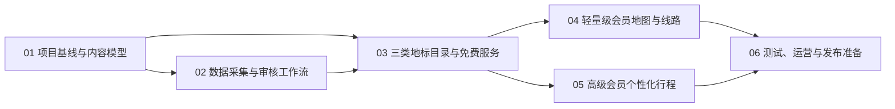

# IP地标旅游应用基础框架实施计划

## 1. 使用方法与总体原则

### 1.1 计划目标

本计划用于从空项目建立一个可演进的 Web 应用基础框架：用户可浏览文学、游戏、影视三类 IP 地标，按 IP 名称与国家/省/市筛选；免费用户可导出文字清单，轻量级会员可查看静态地图和推荐线路，高级会员可获得个性化行程草案。

需求依据：用户提供的 [IP地标旅游项目开发思考.txt](C:/Users/Administrator/Desktop/IP地标旅游项目开发思考.txt) 及新闻链接《全国上千处文学地标 文学IP带火旅行目的地》：<https://www.chinanews.com.cn/cul/2026/08-09/10674478.shtml>。新闻用于说明项目机会，不作为地标事实数据源。

### 1.2 总体设计

采用“一个 Python Web 服务 + 关系型数据库 + 浏览器端地图”的最小架构：FastAPI 提供页面与 JSON API，SQLAlchemy/Alembic 负责数据访问与迁移，PostgreSQL 保存业务数据，Leaflet 仅负责已授权的静态点位展示。前端先使用服务端模板、少量原生 JavaScript 和 CSS；不在基础框架阶段引入独立前端工程、微服务、网页爬虫或爬虫集群。

三类内容共用 `IP作品 → 地标 → 地标来源 → 推荐线路` 模型，通过 `ip_type` 区分文学、游戏、影视。服务层级由服务端权限控制，而不是只隐藏前端按钮。

### 1.3 全局红线与范围边界

1. 地标地址、坐标、简介、交通建议必须保存来源 URL、检索日期、核验状态和编辑人；无来源或未核验数据不得对外发布。
2. 网络搜索候选数据只能通过已签约、可审计的搜索引擎 API 获取；应用不得请求、解析或批量抓取搜索结果所指向的网页，也不得部署网页爬虫。搜索 API 返回的标题、URL、摘要和查询元数据仅作候选线索，不能替代人工核验。
3. 不保存或展示小说全文、游戏素材、剧集片段、海报等受版权保护的内容；简介为原创摘要，作品信息仅保留必要书目/片目元数据和可点击出处。
4. 地图、地理编码、路线与大模型服务均通过官方 SDK/API 接入，密钥只存环境变量，绝不写入仓库或前端包。
5. 首期覆盖中国大陆公开可核验地点；国家、省、市字段保留国际化结构，但跨境数据、实时导航、订单支付、离线地图下载不属于本计划的交付范围。
6. 推荐线路为游览建议而非实时导航或安全承诺；页面须展示数据更新时间、来源和免责声明。
7. 本计划只实现 `free`、`lite`、`premium` 三档账号角色与服务端权益校验；角色由开发/运营后台配置。订单、收款、支付回调、退款、订阅续费及任何资金处理均不属于本计划，待软件功能成熟并确需商业化时另行制定方案。

### 1.4 推荐执行顺序

| 编号 | 计划名称 | 核心目标 | 主要范围 | 预计工作量 |
| --- | --- | --- | --- | --- |
| 01 | 项目基线与内容模型 | 建立可运行应用、统一数据/权限契约 | 目录、配置、数据库、账号角色、基础模型 | 3–4 人日 |
| 02 | 数据采集与审核工作流 | 让网络搜索结果可追溯、可发布 | 候选记录、来源、审核、种子数据 | 4–6 人日 |
| 03 | 三类地标目录与免费服务 | 交付核心检索、筛选与可导出列表 | Web 页面、列表 API、CSV/XLSX 导出 | 5–7 人日 |
| 04 | 轻量级会员地图与线路 | 交付受控的地图点位和静态路线 | 会员鉴权、地图、路线详情 | 4–6 人日 |
| 05 | 高级会员个性化行程 | 交付可追溯、可编辑的行程草案 | 偏好表单、生成服务、行程保存 | 5–8 人日 |
| 06 | 测试、运营与发布准备 | 验证质量、合规与可观测性 | 自动化测试、数据 QA、部署文档 | 3–5 人日 |

### 1.5 依赖关系与并行说明

01 必须先完成。02 与 01 的收尾可并行准备来源清单，但不得在模型定稿前导入正式数据。03 必须使用经 02 审核的发布数据。04 与 05 可在 03 验收后并行；06 从 01 起持续编写测试，并在 04、05 完成后做最终验收。

### 1.6 每次开发的统一要求

1. 修改前阅读本计划对应阶段、根目录 `AGENTS.md` 和涉及模块的测试；实现完成后同步更新 `README.md` 与 `.env.example`。
2. 采用数据库迁移管理结构变化；禁止以手工改生产库替代迁移文件。
3. 每个 API 必须定义请求/响应模型、授权要求、失败状态和测试；筛选、导出、会员权益均由后端复核。搜索 API 还必须记录服务商、查询模板、调用时间、请求标识、配额消耗和结果 URL。
4. 每次导入记录来源、抓取/检索时间、审核结论；坐标与地址冲突时保留冲突说明，不能静默覆盖。
5. 面向用户的提示须明确“推荐游览路线”为静态建议，交通文字说明要注明信息更新时间和来源。

### 1.7 运行、验证环境与全局前置条件

1. 使用项目内 `.venv`，当前开发环境为 Python 3.13；依赖统一写入 `requirements.txt`，运行和测试一律调用 `.venv\\Scripts\\python.exe`。
2. 本地服务依赖 PostgreSQL 16（Docker 或本机实例）；配置 `DATABASE_URL`、`APP_SECRET_KEY`、`MAP_TILE_URL`、`SEARCH_PROVIDER=baidu_web_search` 和 `BAIDU_AI_SEARCH_API_KEY`。密钥只由未纳入版本控制的 `.env` 提供，禁止写入代码、计划、测试夹具、日志和错误响应。AI 行程阶段另配置独立的 `OPENAI_API_KEY`，但不要在日志中输出。
3. 基线命令在 01 完成后固定为：`.venv\\Scripts\\python.exe -m alembic upgrade head`、`.venv\\Scripts\\python.exe -m pytest`、`.venv\\Scripts\\python.exe -m uvicorn app.main:app --reload`。
4. 初始验收数据至少包含文学、游戏、影视各 3 个已审核 IP，且每个 IP 至少 1 个已发布地标；这是演示数据，不代表内容覆盖率。

## 2. 阶段文件

1. [01_项目基线与内容模型.md](01_项目基线与内容模型.md)
2. [02_数据采集与审核工作流.md](02_数据采集与审核工作流.md)
3. [03_三类地标目录与免费服务.md](03_三类地标目录与免费服务.md)
4. [04_轻量级会员地图与线路.md](04_轻量级会员地图与线路.md)
5. [05_高级会员个性化行程.md](05_高级会员个性化行程.md)
6. [06_测试运营与发布准备.md](06_测试运营与发布准备.md)
