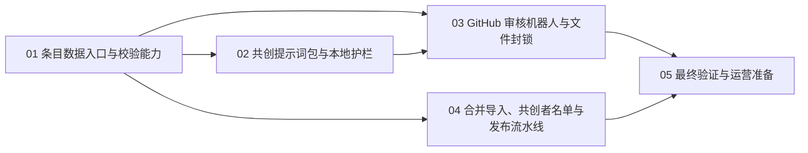

# 共创式条目贡献工作流实施计划

## 1. 计划名称、使用方法与总体原则

### 1.1 计划目标

为项目提供一种「更便捷、稳妥、简单」的共创方式：共创者使用主流的 AI 智能体工具（Codex、Claude Code、WorkBuddy、Qoder 等），只需粘贴一段提示词，即可全自动完成 IP 地标条目的新增；条目以独立文件形式提交 PR，由 GitHub Actions 审核机器人自动把关，维护者合入后进入既有发布流水线。共创者署名使用 GitHub 用户名，并在项目前端提供独立的共创者名单页面。

### 1.2 总体设计

采用「一条地标 = 一个 CSV 文件 + 一个 GitHub Actions 机器人 + 分支保护 + 共创者名单页面」的最小架构：

1. 共创数据入口为 `data/contributions/entries/<ip_type>/<slug>.csv`，一条共创地标对应一个独立文件，天然可 diff、可并发、可逐条评审。
2. 条目字段完全复用 `data/templates/landmark_candidate_template.csv` 的既有 22 列契约；校验逻辑复用 `CandidateRow`（`app/services/import_landmarks.py`），编写无数据库依赖的本地校验脚本，Harness 与机器人共用同一套规则。
3. 审核机器人用 GitHub Actions 实现，负责「文件封锁（只允许新增条目文件）+ 条目校验 + PR 评审留言 + 必须通过的状态检查」，只做确定性审查，不引入 AI 内容审查，也不引入独立 bot 服务。
4. 文件封锁用「机器人路径检查（不可合入）+ main 分支保护（必须通过才可合入）+ CODEOWNERS」组合实现，这是 GitHub 对 fork PR 能做到的最稳妥封锁方式。
5. 数据库发布仍走既有「候选 → 审核 → 发布」流程；机器人只备数据，不直连生产库。
6. 共创者名单文件 `data/contributions/contributors.json` 由导入流水线维护，前端独立页面 `/contributors` 按请求实时读取该文件展示，保持与文件同步。

### 1.3 全局红线与范围边界

1. 首期只做文字条目共创；地标相册图片共创（`data/contributions/landmark_albums/`）已有独立机制，不在本计划范围。
2. 共创 PR 只允许新增 `data/contributions/entries/**` 下的条目 CSV；`app/`、`tests/`、`alembic/`、`scripts/`、`data/seed/`、`data/contributions/contributors.json`、`.github/`、`docs/`、`requirements.txt`、`README.md` 等任何其他文件被共创 PR 改动即拦截、不可合入。
3. 条目必须遵守 `docs/数据采集规范.md` 与 `docs/来源分级与审核准则.md`：必填字段齐全、三段式原创简介、至少一条合格来源 URL；不录入版权内容、不编造来源、不承诺实时营业/交通信息。
4. 机器人只做确定性校验，不调用大模型做内容审查；合入权始终在维护者。
5. CI 只更新种子数据与共创者名单文件，不自动直连生产数据库；生产发布由维护者显式执行。
6. 开发与内部测试阶段仓库保持私有；到共创公开测试时再把仓库转 public（见 1.8 决策 D1）。

### 1.4 推荐执行顺序

| 编号 | 计划名称 | 核心目标 | 主要范围 | 预计工作量 |
| --- | --- | --- | --- | --- |
| 01 | 共创条目数据入口与校验能力 | 定义条目文件格式与目录，提供 Harness/机器人共用的本地校验脚本 | `data/contributions/entries/`、`scripts/validate_contribution_entry.py`、`tests/scripts/` | 2–3 人日 |
| 02 | 共创提示词包与本地护栏 | 交付共创者「复制即用」、兼容主流工具的提示词包与本地文件护栏 | `docs/共创提示词包/`、`scripts/guard_contribution_files.py`、`docs/共创贡献规范.md` | 2–3 人日 |
| 03 | GitHub 审核机器人与文件封锁 | 实现 PR 路径封锁、条目自动校验、评审留言与分支保护 | `.github/workflows/review-contribution.yml`、`.github/CODEOWNERS`、仓库分支保护 | 3–4 人日 |
| 04 | 合并导入、共创者名单与发布流水线 | 把通过审核的条目并入种子数据、以 GitHub 用户名落署名、维护共创者名单文件并上线前端名单页面 | `scripts/import_contribution_entries.py`、`data/contributions/contributors.json`、`app/web/contributors.py`、`seed_initial_landmarks.py` 扩展、publish 工作流 | 3–4 人日 |
| 05 | 最终验证与运营准备 | 端到端演练、回归测试与文档收尾 | 真实 GitHub 演练、`README.md`、共创规范、上线检查清单 | 1–2 人日 |

### 1.5 依赖关系与并行说明

01 必须先完成，它是格式、校验脚本与目录契约的唯一来源。02 与 03 可在 01 验收后并行，但 03 的机器人评审留言会引用 02 的提示词包路径，联调前需拿到 02 的最终文档。04 在 01 完成后即可并行推进（其中前端名单页面不依赖 02/03），端到端联调统一放到 05。

### 1.6 每次开发的统一要求

1. 修改前阅读对应阶段文件、根目录 `AGENTS.md`，以及被改动模块的现有实现与测试。
2. 新增脚本必须有 pytest 覆盖；运行与测试一律用 `.venv\Scripts\python.exe`，依赖写入 `requirements.txt`，不向系统 Python 安装依赖。
3. 不改变 `data/templates/landmark_candidate_template.csv` 与 `app/services/import_landmarks.py::CandidateRow` 的既有契约；新能力以独立脚本、独立目录叠加。
4. 涉及外部调用（如来源可达性检查）的能力一律可失败降级，不阻塞确定性校验与合并。
5. 实现完成后同步更新 `README.md` 与相关 `docs/` 文档。

### 1.7 运行、验证环境与全局前置条件

1. Python 3.13 项目内 `.venv`；基线命令：`.venv\Scripts\python.exe -m pytest`、`.venv\Scripts\python.exe -m uvicorn app.main:app --reload`。
2. 需要 GitHub 仓库 `dragan2023/Worldmark` 的维护者权限，用于配置分支保护与 CODEOWNERS。
3. 端到端演练需要一个测试用 GitHub 账号；私有阶段用「测试协作者账号在仓库内建分支开 PR」方式演练，公开后再验证 fork 流程。
4. 本计划不引入 AI 内容审查，无需额外 API Key。

### 1.8 已确认的决策

1. D1 仓库可见性：开发与内部测试阶段保持私有；到共创公开测试时再把仓库转 public（本次讨论确认，切换时机见 05 阶段）。
2. D2 Harness 工具：指主流 AI 智能体工具 Codex、Claude Code、WorkBuddy、Qoder 等；提示词包按工具无关设计，并在 `00_使用说明.md` 中给出各工具的启动方式。
3. D3 审查方式：仅用 GitHub Actions 实现确定性审查，不启用大模型内容审查。
4. D4 条目署名：使用 GitHub 用户名；项目内建立共创者名单文件 `data/contributions/contributors.json`，由导入流水线维护，前端 `/contributors` 独立页面同步展示。

## 2. 阶段文件

1. [01_共创条目数据入口与校验能力.md](01_共创条目数据入口与校验能力.md)
2. [02_共创提示词包与本地护栏.md](02_共创提示词包与本地护栏.md)
3. [03_GitHub审核机器人与文件封锁.md](03_GitHub审核机器人与文件封锁.md)
4. [04_合并导入、共创者名单与发布流水线.md](04_合并导入、共创者名单与发布流水线.md)
5. [05_最终验证与运营准备.md](05_最终验证与运营准备.md)
